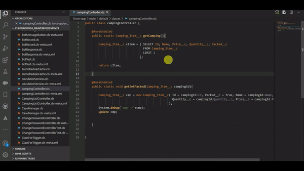

# 【SALESFORCE METADATA INFO】

> This tool helps to Fetch any Metadata information inside VS Code itself and can directly open them in Org.

---

## Dependency:

**Salesforce SFDX** 
**Salesforce CLI** 

> This is not a Salesforce Owned extension, so if any issue arises feel free to log a issue on repository.

---

# Commands

## MDI: Get Metadata Info
 **Command will fetch the Information of opened file.**

## MDI: Get Metadata Info By Selected API Name.
**Get Metadata Info For The Selected API Name.**
  
 

## MDI: Open Item in Org
**Open active file item into Salesforce Org.**
  
 

## MDI: Open Item in Org With Selected API Name.
**Open Selected API Name Metadata in Org.**
  
 

---

# Features

## Currently Supported Types

> Apex Classes, Test Suites, Apex Triggers, Aura Components, Lightning Web Components, Custom Objects, Permission Sets, Documents, Profiles, Quick Actions, Record Types, Static Resources, Validation Rules, Flow, FlexiPage, GlobalValueSet, Page Layouts.

## Open Default In Lightning
**If checked Items will always open in Lightning otherwise in Classic.**

 

---

## Installation

- Visual Studio Market place : https://marketplace.visualstudio.com/items?itemName=AyuSharma-dev.salesforce-md-info
  
---

**Enjoy!**
